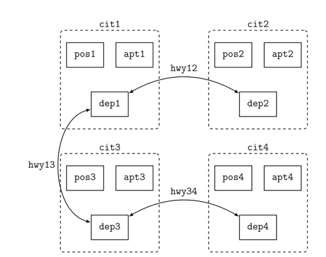

# CS6260: Automated Planning and Learning

The following exercise is a part of the course CS6260, IITM exploring PDDL for the logistics problem.

**Setup**:
- We use the pyperplan project for the planners.
```
git clone https://github.com/aibasel/pyperplan.git
cd pyperplan
pip install - e
cd ..
```
- Setup a virtual environment
```
python3 -m venv venv
source venv/bin/activate
```

- Test.
```
pyperplan benchmarks/tpp/domain.pddl benchmarks/tpp/task01.pddl
```

**Logistics Benchmark**
- One can run some planners in the logistics benchmark as defined in pyperplan.

**1. Update the domain to include a semi vehicle that can move packages between depots through a highway.**

Refer the domain.pddl file for the updates (marked with comment _Added *_)  

**2. Create a new problem file based on task17.pddl but with the new domain based on the image:**
  

Refer the newtask.pddl for the updates (marked with comment _Added *_)  

**3. Run the planner on this problem using GBFS and FF heuristic. What do you notice as you vary the number of airplanes from 0 to 4 or the number of semis from 0 to 4?**

Run:
```
pyperplan benchmarks/logistics/domain.pddl benchmarks/logistics/newtask.pddl -s gbfs -H hff
```

Observations:

NOTE: task17 was slightly modified to enable suitable initializations and goals that highlight the different modes of transport better.

- Planning Time & Nodes Expanded:   
4 airplanes, 0 semis: 3.78s, 199 nodes  
2 airplanes, 2 semis: 19.08s, 1237 nodes  
0 airplanes, 4 semis: 37.38s, 2292 nodes  
- As airplanes increase (semis decrease)  , the planner finds solutions much faster with far fewer nodes expanded.

- Memory Usage:    
4 airplanes: 32,152 KB  
2 semis, 2 airplanes: 50,596 KB  
4 semis: 70,080 KB  
- More semis = more memory required. (Proportional to results in search and nodes expanded.)  

- Plan Length  
2 semis, 2 airplanes: 55 steps  
4 airplanes: 63 steps  
4 semis: 68 steps  
- More efficient plans can be found when multiple modes of transport are supported.

NOTE: While nothing can be conclusively said since it varies with the task initialization and goals, these are valid for the currently specified setup.

*Detailed plans can be found in appendix A*

## Appendix
### A
1. 2 semis, 2 airplanes:

(load-truck obj12 tru1 pos1)  
(load-truck obj31 tru3 pos3)  
(load-truck obj22 tru2 pos2)  
(load-truck obj13 tru1 pos1)  
(load-truck obj11 tru1 pos1)  
(load-truck obj21 tru2 pos2)  
(load-truck obj43 tru4 pos4)  
(load-truck obj32 tru3 pos3)  
(load-truck obj41 tru4 pos4)  
(drive-truck tru2 pos2 depot2 cit2)  
(unload-truck obj22 tru2 depot2)  
(unload-truck obj21 tru2 depot2)  
(fly-airplane apn1 apt1 apt4)  
(load-semi obj22 semi2 depot2)  
(load-semi obj21 semi2 depot2)  
(drive-truck tru3 pos3 apt3 cit3)  
(unload-truck obj31 tru3 apt3)  
(load-airplane obj31 apn2 apt3)  
(drive-truck tru3 apt3 depot3 cit3)  
(unload-truck obj32 tru3 depot3)  
(drive-truck tru4 pos4 apt4 cit4)  
(unload-truck obj41 tru4 apt4)  
(load-airplane obj41 apn1 apt4)  
(drive-truck tru4 apt4 depot4 cit4)  
(unload-truck obj43 tru4 depot4)  
(drive-truck tru4 depot4 apt4 cit4)  
(drive-truck tru1 pos1 apt1 cit1)  
(unload-truck obj12 tru1 apt1)  
(unload-truck obj13 tru1 apt1)  
(unload-truck obj11 tru1 apt1)  
(drive-semi semi2 depot2 depot3)  
(load-semi obj32 semi2 depot3)  
(unload-semi obj22 semi2 depot3)  
(load-truck obj22 tru3 depot3)  
(drive-truck tru3 depot3 pos3 cit3)  
(unload-truck obj22 tru3 pos3)  
(unload-semi obj21 semi2 depot3)  
(drive-semi semi2 depot3 depot2)  
(unload-semi obj32 semi2 depot2)  
(fly-airplane apn1 apt4 apt1)  
(load-airplane obj12 apn1 apt1)  
(load-airplane obj11 apn1 apt1)  
(unload-airplane obj41 apn1 apt1)  
(load-truck obj41 tru1 apt1)  
(drive-truck tru1 apt1 pos1 cit1)  
(unload-truck obj41 tru1 pos1)  
(fly-airplane apn1 apt1 apt4)  
(unload-airplane obj12 apn1 apt4)  
(load-truck obj12 tru4 apt4)  
(drive-truck tru4 apt4 pos4 cit4)  
(unload-truck obj12 tru4 pos4)  
(fly-airplane apn1 apt4 apt3)  
(unload-airplane obj11 apn1 apt3)  
(fly-airplane apn2 apt3 apt1)  
(unload-airplane obj31 apn2 apt1)  

2. 4 airplanes, 0 semis:

(fly-airplane apn2 apt3 apt2)  
(load-truck obj21 tru2 pos2)  
(load-truck obj41 tru4 pos4)  
(load-truck obj12 tru1 pos1)  
(load-truck obj11 tru1 pos1)  
(load-truck obj32 tru3 pos3)  
(load-truck obj43 tru4 pos4)  
(load-truck obj22 tru2 pos2)  
(load-truck obj13 tru1 pos1)  
(load-truck obj31 tru3 pos3)  
(drive-truck tru2 pos2 apt2 cit2)  
(unload-truck obj21 tru2 apt2)  
(load-airplane obj21 apn2 apt2)  
(unload-truck obj22 tru2 apt2)  
(load-airplane obj22 apn2 apt2)  
(fly-airplane apn4 apt4 apt2)  
(drive-truck tru4 pos4 apt4 cit4)  
(unload-truck obj41 tru4 apt4)  
(drive-truck tru4 apt4 depot4 cit4)  
(unload-truck obj43 tru4 depot4)  
(drive-truck tru4 depot4 pos4 cit4)  
(drive-truck tru1 pos1 apt1 cit1)  
(unload-truck obj12 tru1 apt1)  
(load-airplane obj12 apn1 apt1)  
(unload-truck obj11 tru1 apt1)  
(load-airplane obj11 apn1 apt1)  
(unload-truck obj13 tru1 apt1)  
(drive-truck tru3 pos3 apt3 cit3)  
(unload-truck obj31 tru3 apt3)  
(fly-airplane apn1 apt1 apt4)  
(load-airplane obj41 apn1 apt4)  
(unload-airplane obj12 apn1 apt4)  
(fly-airplane apn1 apt4 apt1)  
(unload-airplane obj41 apn1 apt1)  
(load-truck obj41 tru1 apt1)  
(drive-truck tru1 apt1 pos1 cit1)  
(unload-truck obj41 tru1 pos1)  
(unload-truck obj32 tru3 apt3)  
(fly-airplane apn4 apt2 apt4)  
(drive-truck tru4 pos4 apt4 cit4)  
(load-truck obj12 tru4 apt4)  
(drive-truck tru4 apt4 pos4 cit4)  
(unload-truck obj12 tru4 pos4)  
(fly-airplane apn2 apt2 apt3)  
(load-airplane obj32 apn2 apt3)  
(load-airplane obj31 apn2 apt3)  
(unload-airplane obj21 apn2 apt3)  
(load-truck obj21 tru3 apt3)  
(unload-airplane obj22 apn2 apt3)  
(load-truck obj22 tru3 apt3)  
(drive-truck tru3 apt3 pos3 cit3)  
(unload-truck obj22 tru3 pos3)  
(drive-truck tru3 pos3 depot3 cit3)  
(unload-truck obj21 tru3 depot3)  
(fly-airplane apn2 apt3 apt2)  
(unload-airplane obj32 apn2 apt2)  
(load-truck obj32 tru2 apt2)  
(drive-truck tru2 apt2 depot2 cit2)  
(unload-truck obj32 tru2 depot2)  
(fly-airplane apn2 apt2 apt1)  
(unload-airplane obj31 apn2 apt1)  
(fly-airplane apn1 apt1 apt3)  
(unload-airplane obj11 apn1 apt3)  

3. 4 semis, 0 airplanes:

(drive-semi semi4 depot4 depot3)  
(load-truck obj43 tru4 pos4)  
(load-truck obj22 tru2 pos2)  
(load-truck obj12 tru1 pos1)  
(load-truck obj41 tru4 pos4)  
(load-truck obj32 tru3 pos3)  
(load-truck obj11 tru1 pos1)  
(load-truck obj31 tru3 pos3)  
(load-truck obj21 tru2 pos2)  
(load-truck obj13 tru1 pos1)  
(drive-truck tru2 pos2 depot2 cit2)  
(unload-truck obj22 tru2 depot2)  
(unload-truck obj21 tru2 depot2)  
(drive-semi semi1 depot1 depot2)  
(load-semi obj22 semi1 depot2)  
(load-semi obj21 semi1 depot2)  
(drive-truck tru4 pos4 depot4 cit4)  
(unload-truck obj43 tru4 depot4)  
(unload-truck obj41 tru4 depot4)  
(drive-truck tru3 pos3 depot3 cit3)  
(unload-truck obj32 tru3 depot3)  
(unload-truck obj31 tru3 depot3)  
(load-semi obj32 semi3 depot3)  
(load-semi obj31 semi3 depot3)  
(drive-truck tru1 pos1 apt1 cit1)  
(unload-truck obj13 tru1 apt1)  
(drive-truck tru1 apt1 depot1 cit1)  
(unload-truck obj12 tru1 depot1)  
(unload-truck obj11 tru1 depot1)  
(drive-semi semi2 depot2 depot3)  
(drive-semi semi1 depot2 depot3)  
(unload-semi obj22 semi1 depot3)  
(load-truck obj22 tru3 depot3)  
(unload-semi obj21 semi1 depot3)  
(drive-semi semi1 depot3 depot4)  
(drive-truck tru3 depot3 pos3 cit3)  
(unload-truck obj22 tru3 pos3)  
(drive-truck tru3 pos3 depot3 cit3)  
(load-semi obj41 semi1 depot4)  
(drive-semi semi1 depot4 depot3)  
(drive-semi semi3 depot3 depot2)  
(drive-semi semi1 depot3 depot2)  
(drive-semi semi1 depot2 depot1)  
(unload-semi obj41 semi1 depot1)  
(load-truck obj41 tru1 depot1)  
(unload-semi obj32 semi3 depot2)  
(drive-truck tru1 depot1 pos1 cit1)  
(unload-truck obj41 tru1 pos1)  
(drive-truck tru1 pos1 apt1 cit1)  
(drive-semi semi3 depot2 depot1)  
(load-semi obj12 semi1 depot1)  
(load-semi obj11 semi1 depot1)  
(drive-semi semi1 depot1 depot2)  
(drive-semi semi1 depot2 depot3)  
(unload-semi obj11 semi1 depot3)  
(load-truck obj11 tru3 depot3)  
(drive-truck tru3 depot3 apt3 cit3)  
(unload-truck obj11 tru3 apt3)  
(drive-semi semi1 depot3 depot4)  
(unload-semi obj12 semi1 depot4)  
(load-truck obj12 tru4 depot4)  
(drive-truck tru4 depot4 pos4 cit4)  
(unload-truck obj12 tru4 pos4)  
(unload-semi obj31 semi3 depot1)  
(drive-truck tru1 apt1 depot1 cit1)  
(load-truck obj31 tru1 depot1)  
(drive-truck tru1 depot1 apt1 cit1)  
(unload-truck obj31 tru1 apt1)  

---